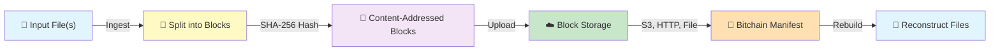

# bitchain

A lightweight **virtual filesystem** that uses the internet as block storage.

`bitchain` is a Rust CLI for managing content-addressed binary chains.
It breaks files into immutable SHA-256 blocks, distributes them across HTTP, HTTPS, S3, or local storage, and reconstructs them on demand.
Perfect for versioning large files, distributing datasets, or building decentralized storage systems.

## Features

- Ingest a single file or directory into a JSON-based bitchain manifest
- Support local file URIs, HTTP(S) URIs, and S3 block URIs
- Upload blocks to S3 when `--uri-base` uses `s3://`
- Dry-run ingesting without writing data
- Rebuild files from a bitchain manifest
- Validate bitchain JSON structure
- Backwards-compatible old-style bitchain format support

## How It Works



Each file is split into fixed-size blocks (default 1MB), hashed with SHA-256, and stored at URIs.
The bitchain manifest records file paths and block URIs, enabling lossless reconstruction from any available block source.

## Install

Build from source:

```bash
cargo build --release
```

Run from the workspace:

```bash
cargo run -- <command>
```

## Development

Use the included Makefile for common tasks:

```bash
make build    # Compile the project
make test     # Run tests
make lint     # Format and lint
make fmt      # Format code
make check    # Run cargo check
make all      # build + lint + test
make run      # Run with arguments
```

## Configuration

Create or update the config file with:

```bash
cargo run -- --setup-config
```

This writes JSON to `~/.bitchain/config`.
If you choose AWS credentials, the CLI will prompt for:

- AWS Access Key ID
- AWS Secret Access Key
- AWS Region
- optional AWS Session Token

## Commands

### `ingest`

Ingest a file or directory and create a bitchain manifest.

```bash
cargo run -- ingest --input path/to/file.iso --uri-base s3://bucket/prefix --output file.bitchain.json
```

For directory ingestion:

```bash
cargo run -- ingest --input ./data --uri-base s3://bucket/prefix --output data.bitchain.json
```

If `--uri-base` is not provided, ingest writes blocks locally and uses `file://` URIs.

Optional flags:

- `--output-dir <dir>`: local directory for block files when `--uri-base` is not set
- `--block-size <bytes>`: bytes per block (default `1048576`)
- `--dry-run`: simulate ingest without writing files or uploading

### `rebuild`

Rebuild files from an existing bitchain JSON manifest.

```bash
cargo run -- rebuild --bitchain file.bitchain.json --output-dir restored
```

This reconstructs each `files[].path` entry under the output directory.
It tries each block URI in order and uses the first successful download.

### `show`

Print a bitchain manifest to stdout.

```bash
cargo run -- show file.bitchain.json
```

### `validate`

Validate the manifest structure.

```bash
cargo run -- validate file.bitchain.json
```

### `Help`

Print CLI help:

```bash
cargo run -- help
```

## JSON Format

Bitchain manifests use the following JSON schema:

```json
{
  "version": "1.0",
  "files": [
    {
      "path": "relative/path/to/file.txt",
      "blocks": [
        {
          "hash": "<sha256-hash-of-block>",
          "uris": [
            "s3://bucket/prefix/relative/path/to/file.txt/<hash>",
            "https://example.com/blocks/<hash>.bin"
          ]
        }
      ]
    }
  ]
}
```

### Field definitions

- `version`: manifest version string
- `files`: array of file entries
- `files[].path`: original file path preserved from ingest
- `files[].blocks`: ordered block list for the file
- `blocks[].hash`: SHA-256 hash of block bytes
- `blocks[].uris`: candidate URIs for the block

### JSON Schema

For formal validation, see [bitchain-schema.json](bitchain-schema.json).
The schema uses JSON Schema draft-07 and validates both the modern multi-file format and legacy single-file format.

## Examples

Run a dry-run of a directory ingest:

```bash
cargo run -- ingest --input ./docs --uri-base s3://alpha.softsurve.com --dry-run
```

Ingest a file locally and produce a manifest:

```bash
cargo run -- ingest --input ./image.iso --output-dir ./blocks --output image.bitchain.json
```

Rebuild from a manifest:

```bash
cargo run -- rebuild --bitchain image.bitchain.json --output-dir ./restored
```

Validate a manifest:

```bash
cargo run -- validate image.bitchain.json
```

<!-- LS-UNIFORM:START -->

## Subprojects

| Path | What it is |
|------|-----------|
| `src/` | Rust source — `main.rs` (CLI entry point), `lib.rs` (Storage Kit library API), content-addressing and block-store modules. |
| `bitchain-schema.json` | JSON schema for bitchain manifests / block metadata. |

## Build & CI

- **Stack:** Rust
- **CI:** Jenkins (`Jenkinsfile`) at `jenkins.softsurve.com`; artifacts publish to Nexus (`nexus.softsurve.com`).
- **Tasks:** `Makefile`.
- **Crate:** `Cargo.toml` (Rust).
- **Secrets:** AWS Secrets Manager, prefix `sol/` (never committed).

## Links

- Agent guide: [`AGENT.md`](./AGENT.md)
- Workspace index: [`../../WORKSPACE.md`](../../WORKSPACE.md)
- **Business unit:** Developer Tools
- **Jira:** `CLUS`
- **Related:** Storage Kit (`clusterzer0/storage-kit`) · Refraction · Quickring Courier

## License

Apache-2.0 (source) — see [`LICENSE`](./LICENSE). Specs CC-BY-4.0 or Apache. Brand/trademarks reserved.

---
*Part of the Lockamy Studios workspace — uniform README pattern. See [`WORKSPACE.md`](../../WORKSPACE.md).*

<!-- LS-UNIFORM:END -->

<!-- LS-PLANS:START -->

## Plans & Design

> This section makes the repo **self-contained**: a developer can clone it and have the studio context, the design decisions, and the cross-cutting plans that govern this work — without needing the rest of the workspace. Repo-specific design files (below) ship in the clone; studio-wide strategy and the relevant decision records are mirrored inline.

### Repo design files (in this clone)

- [`AGENT.md`](./AGENT.md) — full agent/system-prompt context for this repo

<details>
<summary><strong>Studio context</strong> — open for the studio-wide essentials every repo shares</summary>

### Studio essentials (mirrored from `WORKSPACE.md`)

**Owner:** Douglas Lockamy (DJ), Lockamy Studios, Cary NC. Jira: `fairmerce.atlassian.net` (cloudId `f3b17209-1a42-468b-bb7a-73087ac5e6b8`).

**Founding principle — open source first.** Income comes from *executing* ideas (built + hosted software; manufactured + supported hardware), not from owning IP. Source is Apache-2.0; specs CC-BY-4.0 or Apache; contributions under DCO/CLA. Carve-outs that stay closed: brand & trademarks (`bitchain`, `Quickring`, `Current`, `Courier`, `Lockamy Studios`), customer data & telemetry, abuse/fraud/security signals, and embargoed security fixes.

**Brand architecture.** Two registers, one studio. **Lockamy Studios** is the open heart (OSS identity, community register, maker hardware, developer tools `clusterzer0`, agent OS, spec-first products). **Thunderhead Systems** is the premium finished-product brand, held until the Production hardware tier is real.

**Business units.** Foundations (Sol, Digital Zen) · Personal Computing (DeviceNix, BenixOS, Thunderhead, Quickring, the kits) · Developer Tools (bitchain, Refraction, slashbuilder — org `clusterzer0`) · Games (Pogo Pops, i95north — dormant). Ventures: Spec-Up (Miette Lewis, `SPEC`), Nodeul (Neptune Valentin, `NOD`).

**Language convention (locked 2026-05-30).** Rust everywhere except the Flutter/Dart UI facade. Dart reaches Rust via `flutter_rust_bridge`; native bindings via `uniffi`; C ABI via `cbindgen`. Every Flutter app builds on Design Kit. Refraction pivoted Go/Gin → Rust/axum on 2026-05-30.

**Kit model (BeOS-style, locked 2026-05-30).** Kits are reusable libraries with stable APIs (Rust crates / Dart packages); Products compose Kits. New kits use the `-kit` suffix; legacy `devicenix`/`benixos` single-token kit names remain. All GitHub repo names are lowercase.

**Shared infrastructure.** CI: Jenkins (`jenkins.softsurve.com`) — every repo has a Jenkinsfile. Artifacts: Nexus (`nexus.softsurve.com`) — Cargo, Docker, RubyGems, APT, Dart. Secrets: AWS Secrets Manager, prefix `sol/` (never committed). Jenkins credential IDs: `nexus-credentials`, `github-token`, `io-ssh-key`, `aws-sol-deploy`. Sol network naming: network = Sol; servers = planets (io, mars, jupiter); virtual hosts = moons/asteroids (nexus, jenkins, grafana).

**Design system.** Digital Zen — stone neutrals, sage green, golden tab motif; Fraunces (display) + DM Sans (body) + IBM Plex Mono (data). Applies to all user-facing surfaces.

**Hardware platforms.** Aether family (Pi 5 / CM5) carries Cumulus / Wisp / Halcyon. Forge family (micro-ATX 244×244mm) carries Anvil / Squall (and eventual Stratus). Four-tier hardware ladder: Maker → Kit → Assembled → Production.

</details>

### Decision records (mirrored from `softsurve/sol/weekly/`)

<details>
<summary><strong>Kit Model Lock (2026-05-30)</strong></summary>

# Kit model + language stance lock — May 2026

A record of the May 2026 strategic lock that (1) adopted Rust + Flutter/Dart as the studio's language convention across the board (pivoting Refraction from Go/Gin to Rust/axum), (2) introduced "Conductor" as a class with Maestro as Cumulus's specific Conductor, (3) recognized that the shared logic constitutes a Quickring SDK plus a Thunderhead-specific framework on top, and (4) adopted the BeOS Kit model as the studio's code-organization pattern.

Companion to the Conductor design pass recorded in `2026-05-conductor-app-design.md`; this doc captures the strategic layer that conversation pulled out into the open.

---

## Language stance locked — Rust + Flutter/Dart across the board

The studio is a **Rust shop with a Flutter/Dart UI facade**. Not "Rust on devices and SDK, Go on backend, Dart on UI" — Rust everywhere except where the platform forces a different rendering layer.

- **Rust** for all substrate, services, devices, and Kits — bitchain, messagekit, Current, Score Kit, Fabric Kit, Refraction, Maestro, on-device DeviceNix code, oskit.
- **Flutter/Dart** is the UI facade for endpoints we can't reach natively (iOS, Android, macOS, Windows). Every Flutter app builds on Design Kit (the Digital Zen package). Dart reaches Rust cores via `flutter_rust_bridge`. Direct-native iOS / Android bindings (if ever needed) come via `uniffi`. Third-party arbitrary-language consumers reach Rust over C ABI via `cbindgen`.
- The only narrow exception is BenixOS's desktop shell, which uses native OS widgets where the platform requires them.

**Refraction pivots from Go/Gin to Rust/axum.** Pre-implementation timing makes this the cheap moment to make the call. Architecture (self-hosted + SaaS, S3 storage, MongoDB metadata, OpenAPI surface, bitchain block protocol, Digital Zen UI) stays unchanged.

**Production-Rust precedents cited as confidence:** Cloudflare Pingora (their open-source HTTP proxy that replaced nginx on their edge), Discord's "Read States" migration from Go to Rust for tail-latency reasons, AWS Firecracker (the VMM behind Lambda and Fargate), Linkerd 2 data plane, Sentry Relay, AWS Bottlerocket, Mozilla services. Discord's public engineering post is the most directly relevant precedent for Refraction.

**The framework: axum.** Built by the tokio team. Currently the most popular and best-supported Rust web framework. Feels structurally similar to Gin. Stack: `axum` (web framework) on `tower` (middleware) on `hyper` (HTTP) on `tokio` (async runtime), with `sqlx` or `sea-orm` for database, `serde` for serialization, `tracing` for structured logging.

---

## Conductor as a class; Maestro as Cumulus's Conductor

The SpringBoard analogy from the Conductor design pass surfaced the question: does each device get its own bespoke Conductor-equivalent, or do we build one configurable Conductor service, or shared core + per-device shells?

**Answer: shared core + per-device shells**, the pattern iOS / macOS / GNOME use. Cumulus, Wisp, Squall, Halcyon all need household-presence surfaces (Anvil is compute, no surface). Four codebases reimplementing presence subscription / scene state / Sonic Signature / capability framework is too much for a solo founder. But the surfaces are genuinely different, so a single-binary "configure it differently" approach is wrong too.

**The split:**

- **Conductor** is now the **class** — the device-surface-app pattern.
- **Maestro** is Cumulus's specific Conductor (the instance).
- Future device Conductors get their own names at their epic time (Wisp / Squall / Halcyon's names deferred).

THUN-23 renamed from "Conductor app" to **"Maestro — Cumulus's Conductor"**. Scope narrowed: Maestro is now specifically the device-specific shell on top of Score Kit.

---

## We stumbled into an SDK — actually, two layers

The shared-core question from the Conductor design pass turned out to be sharper than first sketched. The shared logic splits cleanly along **brand boundaries** into two layers:

**Quickring SDK (Fabric Kit)** — brand-neutral, lives with Quickring:
- Quickring topic publish/subscribe (client wrapper around Current).
- Scene-state client + sync semantics.
- Family-graph client + presence model.
- Pairing-token primitives.

This is what *anybody* building on Quickring uses — the phone Courier app, Refraction's user-side UI, third-party Quickring apps, and (transitively) every Thunderhead device Conductor.

**Score Kit** — Thunderhead-specific, sits on top of Fabric Kit:
- Capability-declaration framework (Thunderhead-side of the THUN-13 capability gate).
- Sonic Signature decoder + playback (Lockamy/Thunderhead brand asset, *not* a Quickring concept).
- Notification throttling / silence-window logic for surface apps.
- Conductor-class abstractions (mode transitions, focus management, the pattern itself).

The brand boundary is the test that confirms the split is real: putting the Sonic Signature in a Quickring SDK pollutes the brand boundary (Quickring is a fabric, not an audio brand); putting the capability gate in a Quickring SDK conflates fabric with runtime.

**Three-layer architecture:**

```
Quickring SDK (Fabric Kit)  →  Score Kit  →  Maestro    (Cumulus's Conductor)
                                          →  [TBD]      (Wisp's Conductor)
                                          →  [TBD]      (Squall's Conductor)
                                          →  [TBD]      (Halcyon's Conductor)
```

Each layer's audience is distinct: Fabric Kit serves any Quickring-aware developer; Score Kit serves Thunderhead-device Conductor authors; Conductors serve end users.

---

## BeOS Kit model adopted

Pulling on the SDK thread led to the broader recognition that the studio's capability surface organizes cleanly into Kits (after the BeOS pattern) — reusable, well-specified libraries with stable APIs, composed by Products (the apps, services, and devices we ship).

**Distinction the Kit/Product split gives us:**

- **Kits** are the reusable building blocks. Rust crates or Dart packages. Self-contained domains. Anyone can use them.
- **Products** are what we ship to users. They compose Kits. They aren't Kits themselves.

For example: bitchain CLI is a *product* that consumes Storage Kit. Refraction is a *product* that consumes Service Kit + Storage Kit + Identity Kit. Maestro is a *product* that consumes Score Kit (which transitively pulls in everything else).

---

## The Kit taxonomy

Eleven Kits across four BU/project homes. Repo names follow the `*-kit` suffix convention for disambiguation from products.

### Foundation Kits — Lockamy Studios (cross-cutting commons)

| Kit | Provides | Jira |
|---|---|---|
| **Spec Kit** | Spec-writing methodology, version conventions, conformance harness primitives. | LS-43 (new) |
| **Identity Kit** | Account model, family-graph model, AuthN client (Auth0 → Keycloak), token caching, AuthZ primitives. | LS-20 |
| **Service Kit** | axum scaffolding, middleware, structured logging, config loading, observability. | LS-41 (new) |
| **Design Kit** | Digital Zen as a Dart package — typography, palette, Golden Tab semantic-dot widget, household-surface primitives. | LS-42 (new) |

### Developer-Tools Kits — clusterzer0

| Kit | Provides | Jira |
|---|---|---|
| **Storage Kit** | bitchain `lib`: content addressing, block stores, manifests, manifest verification. | CLUS-1 |
| **Messaging Kit** | messagekit: local IPC base, AF_UNIX SOCK_SEQPACKET router, T/R/D + RError grammar. | DEV-1 (strategic home is clusterzer0; physical repo move from `devicenix` to `clusterzer0/messaging-kit` planned but deferred — not urgent) |

### Fabric Kit — Quickring org

| Kit | Provides | Jira |
|---|---|---|
| **Fabric Kit** | Quickring SDK — topic pub/sub, scene-state client, family-graph sync, pairing primitives. | QR-29 (new) |

### Device Kits — Thunderhead Systems

| Kit | Provides | Jira |
|---|---|---|
| **Platform Kit** | Aether (Pi 5) and Forge (AMD64) carrier support — boot stack, GPIO, pogo-pin presence-detect. | THUN-7 |
| **Device Kit** | Hardware abstractions: display drivers, audio (PipeWire), input handling, sensor APIs, the oskit device-enumeration runtime. | DEV-25 + surrounding work |
| **Score Kit** | Conductor framework — capability-declaration helpers, Sonic Signature decoder + playback, notification throttling, Conductor-class abstractions, mode patterns. | THUN-32 (new) |
| **App Store Kit** | Podman/crun runtime, OCI manifests, capability gate, app signing + verification. | THUN-13 |

---

## Products that compose Kits

| Product | Kits consumed | Home |
|---|---|---|
| **bitchain CLI** | Storage | clusterzer0 |
| **Current daemon** | Messaging, Identity, Fabric | Quickring |
| **Refraction** | Service, Storage, Identity | clusterzer0 |
| **Quickring Courier** | Fabric, Design, Identity | Quickring |
| **Thunderhead dashboard** (phone) | Fabric, Design, Identity | Thunderhead |
| **Maestro** (Cumulus's Conductor) | Score (+ transitive: Fabric, Device, Storage, Identity, App Store) | Thunderhead |
| **Cumulus / Wisp / Squall / Halcyon** | Platform, Device, App Store + the device's Conductor | Thunderhead |
| **Anvil** | Platform, Service, App Store | Thunderhead |

---

## Dependency hierarchy (no cycles)

```
Spec Kit ← all other Kits' specs (governance)
Identity Kit ← Service, Fabric, Score, App Store
Messaging Kit ← Fabric (Current is messagekit's remote-transport provider)
Storage Kit ← Refraction, Score, Maestro, Courier
Platform Kit ← Device
Device Kit ← Score, on-device Conductor shells
Fabric Kit ← Score, Courier, Refraction UI
App Store Kit ← Thunderhead OS, every Conductor installation
Score Kit ← every device Conductor
Design Kit ← every Flutter UI app
Service Kit ← Refraction, future SaaS services
```

---

## Decisions locked

1. **Language convention** — Rust everywhere except the Flutter/Dart UI facade. Refraction pivots Go → Rust/axum. Captured in `WORKSPACE.md`.
2. **Conductor is a class; Maestro is Cumulus's Conductor.** Future device Conductors get their own names at epic time.
3. **The shared logic is two Kits, not one.** Brand boundary splits it: Fabric Kit (brand-neutral Quickring SDK) and Score Kit (Thunderhead-specific Conductor framework).
4. **BeOS Kit model adopted.** Eleven Kits across four BU/project homes. Repo suffix `-kit` to disambiguate from products.
5. **Spec Kit lives at Lockamy Studios** as cross-cutting OSS-first commons.
6. **Messaging Kit's strategic home is clusterzer0**; the physical repo move from `devicenix` to `clusterzer0/messaging-kit` is planned, not urgent.
7. **Eleven Kits is the right granularity for now.** Network Kit (NAT traversal stays inside Fabric Kit) and Telemetry Kit (stays inside Service Kit + Score Kit) deliberately not split out; can be extracted later if they grow.

---

## Files & Jira

- `WORKSPACE.md` — language convention rewritten; repos table updated for Refraction and Thunderhead language; new Kit repos added; new "Kits and Products" section.
- `thunderhead-systems/thunderhead/docs/maestro-spec.md` — renamed from `conductor-app-spec.md`; updated for Maestro framing + Kit layering. Old `conductor-app-spec.md` removed.
- This file.
- THUN-23 renamed "Conductor app" → "Maestro — Cumulus's Conductor"; description narrowed to Maestro on Score Kit.
- New epics: QR-29 (Fabric Kit), THUN-32 (Score Kit), LS-41 (Service Kit), LS-42 (Design Kit), LS-43 (Spec Kit).
- CLUS-2 (Refraction) — description updated for Rust/axum language pivot.
- Kit-framing comments added to existing Kit-aligned epics: CLUS-1 (Storage), DEV-1 (Messaging), LS-20 (Identity), THUN-7 (Platform), THUN-13 (App Store), DEV-25 (Device).

---

## Open items

- **Refraction language pivot execution** — actual code work to migrate the existing Go/Gin scaffolding to Rust/axum. Tracked under CLUS-2's existing story breakdown.
- **Messaging Kit physical repo move** — `devicenix` → `clusterzer0/messaging-kit`. Low priority; do when convenient.
- **Maestro shell tech stack** — THUN-24 owns the call (Flutter Embedded / Slint / custom Rust + framebuffer).
- **Maestro visual design entry** — `design-decisions.md` entry to be added once shell tech-stack story is decided.
- **Future device Conductor names** — Wisp / Squall / Halcyon's Conductor names lock at their device-epic time.
- **Anvil v0 product spec** — still pending from prior sessions.
- **Master plan deck refresh** — stale; due an update with Kit framing + brand architecture.

</details>

<details>
<summary><strong>clusterzer0 / Quickring Review (2026-05)</strong></summary>

# clusterzer0 & Quickring — Product Restructure — May 2026

A record of the bitchain-suite review and the Quickring consumer-product
restructure conducted May 2026, following on from `2026-05-architecture-review.md`.
Covers the clusterzer0 business unit, the bitchain spec-first architecture, the
Quickring brand split, the studio-wide UI decision, and the Jira restructure.

---

## The clusterzer0 business unit

The Developer Tools business unit is named **clusterzer0**. The existing (until
now empty) `clusterzer0` GitHub org is its code home; its Jira project is **CLUS**.

Members: **bitchain** (CLI), **refraction** (server), **bitchain-studio**
(dissolved — see below), **slashbuilder**. The bitchain suite and `slashbuilder`
were moved out of the `dlockamy` org into `clusterzer0`; `dlockamy` is now
personal-only (`dlockamy.github.io`).

---

## bitchain — spec-first architecture

The central reframe: **bitchain is a specification, not a program.** The manifest
format plus the content-addressing rules (how files split into SHA-256 blocks,
how block URIs are formed, how reassembly and verification work) are the product.
The Rust CLI, refraction, and any future client are *implementations* of the spec.

- **The Rust CLI is the canonical reference implementation.** The spec lives with
  it: the `bitchain` repo becomes a monorepo — `/spec` (spec + conformance
  fixtures, implementation-neutral) and `/cli` (the Rust reference).
- **Factor a core `lib` crate + a thin `cli`.** Every downstream surface — OS
  shell extensions, the Courier app, future language bindings — links the lib
  rather than shelling out to the CLI.
- **A conformance test suite** (fixtures any implementation must pass) makes
  future language bindings cheap and safe — built on demand, not pre-emptively.
- **Open spec decision:** fixed-size vs content-defined chunking. CDC dedups far
  better across edited versions; it is a spec-level call, not an implementation
  detail.

Review findings now tracked as work: the shipped CLI manifest format and the
docs/refraction format have drifted (no canonical spec); the bitchain↔refraction
API is not aligned; bitchain's `AGENT.md` is stale against its shipped code.

---

## refraction — commercial model

refraction stays self-hostable as a core requirement, and adds a true hosted
SaaS — customers choose their buy-in level (the Jira / Sonatype-Nexus pattern).
Open-core editions (Community / Pro / Enterprise) are gated by a license flag at
runtime within **one codebase** — never forks. The Community self-hosted tier
doubles as the discovery / top-of-funnel channel.

---

## Quickring — consumer brand restructure

**Quickring is the consumer brand**, kept deliberately — the "QR" ↔ QR-code play
is intentional marketing. What was previously all under the "Quickring" name is
now broken into code-named components:

- **Current** — the messaging fabric: the messagekit remote-transport provider,
  pairing, presence, pub/sub. The code name for what QR-1 and QR-13 build.
- **Courier** — the consumer file-sharing app (working code name).
- the Quickring messaging experience (feed, DMs, presence — QR-10).

**bitchain-studio is dissolved.** There is no standalone consumer "studio" user:
the asset-versioning use case belongs to refraction, and the consumer use case is
*file sharing* — which is Quickring. **Quickring Courier** is the consumer
file-sharing app, the relocated and reframed bitchain-studio.

**Out-of-band file sharing:** a bitchain manifest is small JSON — it rides in
band as a Current message; the file's blocks move out of band. bitchain is the
reference mechanism, so the fabric never hauls large payloads. A
**block-availability / transport contract** is required — consumer peers are not
always-on, so blocks need a reachable home (a relay, a hosted cache, or the
storage tiers below).

---

## Storage tiers & shared foundations

Storage is offered as a spectrum, the customer's choice:

- **self-hosted, always-on** — the user's own box; a **Thunderhead** appliance is
  the natural "bring your own block store" (especially the Anvil NAS device).
- **fully hosted, invisible** — managed storage; the hook for a Quickring
  subscription business (family plans — "Apple Family+, device-agnostic").

Three capabilities surfaced as **shared foundations** — used by the Current
fabric, refraction, and the consumer product alike, so not owned by any one
product:

- **hosted block-storage service** — a managed layer over R2 / B2, not
  self-operated disks; backs both refraction's hosted tier and Quickring storage.
- **accounts & identity** — auth / OIDC, family groups, per-member roles & quotas.
- **billing & subscriptions** — plans and payments; Quickring family plans and
  refraction's commercial tiers.

These are parked in the **LS** Jira project for now — not their own projects yet.

---

## Conventions adopted

**UI framework — Flutter.** Flutter is the studio-wide UI standard: Quickring
(including Courier), refraction, and the Thunderhead dashboard all build on the
Digital Zen Flutter package, which enables shared UI/UX code across them. The
exception is native OS widgets where the platform requires them (e.g. the BenixOS
desktop shell). Rust/Go cores are reached from Dart over FFI
(`flutter_rust_bridge`). Recorded in `WORKSPACE.md`.

---

## Jira restructure

**New project CLUS (clusterzer0):**

- **CLUS-1** bitchain — CLUS-4 (refraction storage backend), CLUS-5 (reconcile
  manifest format), CLUS-6 (refresh `AGENT.md`), CLUS-20 (define the spec —
  blocks CLUS-5 and CLUS-7), CLUS-21 (monorepo + `lib`/`cli`), CLUS-22
  (conformance suite).
- **CLUS-2** refraction — CLUS-7 (API alignment), CLUS-8 (Digital Zen UI — done),
  CLUS-9 (auth), CLUS-10 (Mongo manifest persistence), CLUS-11 (UI expansion),
  CLUS-12 (K8s/Helm), CLUS-23 (edition / licensing), CLUS-24 (hosted SaaS).
- **CLUS-3** bitchain-studio — **retired**; CLUS-13…19 closed, work moved to
  Quickring Courier.

**Legacy KAN** — KAN-80 / 81 / 82 / 88 / 89 (the bitchain family) closed and
cross-linked to their CLUS replacements.

**QR (Quickring):**

- **QR-16** bitchain integration — out-of-band file sharing — QR-17
  (block-availability / transport contract, blocked by CLUS-20), QR-18 (send),
  QR-19 (receive & reassemble).
- **QR-20** Quickring Courier — QR-21 (framework — resolved: Flutter), QR-22
  (send UX), QR-23 (receive UX), QR-24 (storage-tier config), QR-25 (shell
  extensions), QR-26 (packaging).
- **QR-1** and **QR-13** relabelled to lead with the fabric code name *Current*.

**LS (foundations):** LS-19 hosted block-storage service, LS-20 accounts &
identity, LS-21 billing & subscriptions — epics, not yet broken into stories.

**THUN:** THUN-21 — bitchain block-store service for Thunderhead (under the
app-store epic THUN-13).

---

## Documentation updated

- `WORKSPACE.md` — Flutter UI standard; Quickring brand / Current fabric;
  bitchain-studio retired; casing-rename note marked complete.
- `2026-05-architecture-review.md` — stale open items reconciled.
- `2026-05-git-handoff.md` — execution-status banner.
- This file.

---

## Hardware-platform decisions

Two late calls on the Thunderhead hardware brief:

- **Router / Wi-Fi integration into Cumulus or Anvil — rejected.** Quickring/Current is already designed NAT-friendly (outbound WebSocket to the hub), so the routing-freedom benefit is largely illusory. The security operating load (always-on gateway exposure, CVE response, the incoming EU CRA / UK PSTI regimes), the lifecycle mismatch (3–5 year router cadence vs 7–10 year appliance cadence), and the market positioning (appliance-on-existing-network, not network replacement) all weigh against it. Thunderhead stays an appliance on the customer's existing network.
- **Mesh-VPN integration tracked as a Quickring Day-2 offering.** WireGuard / Tailscale-style mesh node on every Quickring agent and Thunderhead appliance — peer-to-peer reachability regardless of NAT, the routing-freedom story without router responsibility. Logged as **QR-28** under the Quickring v3+ ecosystem phase; NAS-world precedent (Synology, Unraid, TrueNAS).
- **Compute form factors locked.** All Thunderhead devices use either the Raspberry Pi family (Aether, THUN-7 — Pi 5 SBC primary, Compute Module 5 for industrial integration, carriers HAT-compatible; the 40-pin GPIO header is sacred) or **micro-ATX** (Forge, THUN-6 — 244×244mm, four expansion slots, supports the low-profile GPU and 4-bay HDD carrier Anvil targets). Surrounding standards along for the ride: M.2 NVMe 2280, SATA III, USB-C PD, ATX/SFX PSU, M.2 E-key for replaceable Wi-Fi. Deliberate trade — passing on the NUC / mini-PC ecosystem (smaller, quieter, BGA-soldered) in favour of upgradeability and ecosystem depth. Customer-upgrade tiers: routine (RAM, storage, NIC, GPU) any time; full compute-board swap as a Year 3+ story.

---

## Founding principles locked

**Open source first and always.** Lockamy Studios derives income from *executing* ideas, not from owning their IP. Source code is open; commercial offerings are the built and hosted versions. Hardware designs are open; commercial offerings are finished products manufactured and supported to those designs. The moat is operational excellence, finish, support, and the brand — never secrecy.

Carve-outs that make the principle workable: brand and trademarks are not open (registered and defended); customer data and operational telemetry are not open; abuse / fraud / security signals where publishing them would defeat the purpose are not open; coordinated-disclosure security fixes are private during their embargo window. Everything else opens by default — from inception, not only at release.

Licence stack: Apache 2.0 for source; CC-BY-4.0 (or Apache) for specs; contributions under DCO or lightweight CLA so the studio retains relicensing flexibility.

Recorded in `WORKSPACE.md` as a foundational entry. OSS execution work captured under a new LS Foundations epic (license, CLA/DCO, trademark filings, repo hygiene), with the three-phase rollout per the May-2026 OSS-roadmap discussion.

---

## Open items

- **The bitchain spec (CLUS-20) is the keystone** — it blocks the manifest
  reconciliation, the refraction API alignment, and the Quickring
  block-availability contract. Write it first.
- **Per-repo docs not yet updated** — the bitchain `AGENT.md` + monorepo
  restructure (CLUS-6, CLUS-21) and the Quickring repo docs (Current / Courier
  framing). Repo-level work, separate from this studio-level record.
- **LS foundations epics** (LS-19/20/21) are not yet broken into stories.
- **Courier** and **Current** are working code names — both easily changed.
- **QR-10** ("v1 experience") is the Quickring messaging experience — neither
  Current nor Courier; the QR project now holds three components.
- **`silver-iodide`** — deleted 2026-05-24. ✔️
- **Master-plan deck** predates this restructure and is now stale (no clusterzer0
  / Current / Courier).
- **Build has not started** — every clusterzer0 and Quickring epic is To Do.
- Carried from the architecture review: Jenkins org-folder (JCasC) corrections;
  Spec-Up org consolidation.

</details>

<details>
<summary><strong>Community-Funded Strategy (2026-05)</strong></summary>

# Community-funded strategy & brand architecture — May 2026

A record of the May 2026 strategic-posture decisions: the community-funded capital approach, the Lockamy Studios / Thunderhead Systems brand split, the Refraction strategic posture, the four-tier hardware ladder, and the slashbuilder pivot to open-hardware storefront. Companion to the founding principle locked earlier (`WORKSPACE.md` — Lockamy Studios is open source first and always) and to the OSS-rollout work tracked under LS-36.

---

## The capital posture — community-funded by default

VC is held as optional bridge capital only — a single angel cheque if it accelerates one specific thing — never as the primary growth strategy. The studio does not need to grow into a valuation; it needs to ship and serve a community.

Revenue tracks compound as the community grows:

1. **Refraction commercial tiers** — Community → Pro → hosted SaaS. The natural commercial face of bitchain.
2. **slashbuilder components** — Pi 5 boards, microSDs, sensors, microcontrollers; the BOM Lockamy itself uses.
3. **slashbuilder kits** — packaged complete kits per Thunderhead device, customer assembles.
4. **Hand-built assembled hardware** — Lockamy v0 units, premium pricing, lower volume.
5. **Refraction + Thunderhead support contracts** — paid hours, scales linearly with the catalog and the install base.
6. **Quickring family plans** — opens later; slow ramp; long tail.
7. **GitHub Sponsors / Open Collective** — supplemental, not core.

Precedent: Adafruit (Limor Fried; bootstrapped to >$40M revenue), Sparkfun, Prusa Research, System76, Framework Computer. All built substantial businesses without VC by stacking open hardware + component sales + community + premium editions.

The **unified-BOM insight** is what makes the math work: slashbuilder's catalog *is* Lockamy's internal supply chain. Larger wholesale orders drop the cost basis on the studio's own hardware; community sales subsidise internal builds.

---

## The brand architecture — Lockamy Studios + Thunderhead Systems

Two registers, one studio:

- **Lockamy Studios** is the open heart — OSS-first identity, community register, maker hardware tier, the developer-tools (clusterzer0) side, the agent operating system, the spec-first products, slashbuilder's storefront. Where the work *happens* in the open.
- **Thunderhead Systems** is the premium finished-product brand — held in reserve until the Production tier of hardware is real. The Cumulus / Anvil / Wisp / Squall / Halcyon family eventually graduates to Thunderhead Systems at the high-finish end (Stone 100 powder-coated steel, anodised aluminium, design language at full polish); until then Lockamy Studios carries both.

The brands share design language, OSS code, and supply chain. The split is *register*, not function. Thunderhead Systems wakes up when the hardware is ready to wear it; until then it sits dormant as a held trademark (registered under LS-39).

---

## The hardware ladder — four tiers

| Tier | Brand | Description | Rough price |
|---|---|---|---|
| Maker | Lockamy Studios | Free STL + KiCad + BOM downloads; slashbuilder component bundle optional | Free design / paid components |
| Kit | Lockamy Studios | Complete kit shipped by slashbuilder; customer assembles | $300–600 |
| Assembled | Lockamy Studios | Lockamy hand-builds v0 to order | $1.5–2.5K |
| Production | Thunderhead Systems | Manufacturing run, Stone 100 powder-coat / anodised aluminium | $2–3K+ |

Each tier funds the next. The Maker tier brings people into the brand at zero cost; the Production tier is what eventually scales the business.

Hardware v0 is engineered to be **3D-printer-friendly** to make the Maker tier real from day one — printable shells, off-the-shelf electronics, assembly guides as docs. The Maker visual register is deliberately distinct from the eventual Production finish so neither dilutes the other.

---

## Refraction strategic posture

Refraction is built, tested, and accepted as income if it comes. The studio does **not** chase Refraction enterprise sales as the primary revenue engine; the SaaS opportunity is real but not allowed to distract from building the full open-source suite.

- bitchain is the load-bearing piece — Quickring needs it for out-of-band file sharing.
- Refraction is its natural commercial face — the spec needs a server-side reference, and that server happens to be sellable as managed hosting.
- If Refraction takes off organically, it funds the rest. If not, it stays the open-core baseline that gives bitchain credibility.

The LS-30/31/32/33 identity work and CLUS-23/24 commercial-tier work proceed as planned — they serve the open-core baseline regardless of whether Refraction becomes a major revenue track.

CLUS-2 description updated 2026-05-28 with this posture.

---

## slashbuilder pivot — open-hardware storefront

slashbuilder was originally framed as a "DevOps community portal" stub. Reframed as the open-hardware storefront and component-supply hub.

- Stocks the same BOM Lockamy uses for its own builds — unified supply chain.
- Sells components, kits, assembled hardware — three of the four tiers above.
- Catalog curated to the Lockamy / Thunderhead family; not generic.
- Brand register: Lockamy Studios (the open heart).

`clusterzer0/slashbuilder/CONTEXT.md` rewritten 2026-05-28. New CLUS epic created for the implementation work, with initial sub-stories for tech stack, catalog SKU set, fulfilment infrastructure, and storefront UX.

---

## Financial sketch under the community-funded model

| Phase | Window | Revenue (rough) | Burn (rough) | Capital event |
|---|---|---|---|---|
| 1 | Q1–Q2 | $0 | $30–60K total | Bootstrap |
| 2 | Q3–Q4 | $60–150K (Refraction design partners) | $60–100K (solo) | None |
| 3 | Q5–Q6 | $300–700K (Refraction + slashbuilder soft launch + kits + hand-builds) | $100–180K (1 hire) | Optional small angel cheque if needed |
| 4 | Year 2 | $650K–$1.5M (compounding tracks) | $250–400K (3–4 person team) | Optional Kickstarter as community-funded production run |

Cary cost-of-living is the friend here; SF/NYC numbers would be ~2× the burn lines.

The Kickstarter idea isn't dead — it just becomes a community-funded production run later, after the Maker and Kit tiers prove demand. That's better Kickstarter discipline than launching cold.

---

## Risks under this model

- **Inventory operations are real work** — SKUs, restocking, fulfilment, returns, customs. Budget 10–20 hrs/week once slashbuilder has a meaningful catalog; $5–15K/year in fulfilment infrastructure. First inventory mistake (dead stock, customs surprise) typically costs $5–20K to recover from.
- **Certification doesn't disappear because the device is DIY** — selling a kit with a Wi-Fi module still triggers FCC/CE for the kit. Mitigation: use pre-certified modules (Pi 5 onboard radio is FCC-cleared); don't sell anything combining RF with custom antenna design.
- **The DIY market is smaller than the consumer one** — Cumulus-builder ≠ Cumulus-buyer. Volume is 10–100× smaller than mass-consumer. The community starts the business; the Production tier eventually carries it.
- **Community management compounds** — 20–30% of one person's time once community has scale. Community / ops lead is the third or fourth hire (probably Year 2).

---

## Decisions locked

1. **Community-funded by default**; VC optional bridge capital only.
2. **Brand split:** Lockamy Studios (open heart) + Thunderhead Systems (premium production, dormant for now).
3. **Refraction:** build, test, accept income if it comes; don't chase as primary revenue.
4. **Four-tier hardware ladder** (Maker → Kit → Assembled → Production).
5. **slashbuilder = open-hardware storefront + component supply hub.**

---

## Files & Jira

- `WORKSPACE.md` — Brand architecture and Strategic posture sections added.
- `clusterzer0/slashbuilder/CONTEXT.md` — rewritten for the storefront pivot.
- This file.
- New CLUS slashbuilder epic + initial sub-stories.
- CLUS-2 (Refraction) description updated with the strategic posture.
- LS-22 (positioning) commented with the brand-architecture note.

---

## Open items

- Storefront tech stack decision for slashbuilder (Shopify vs Snipcart-on-static vs custom Go/Gin + Postgres).
- Initial catalog SKU set for slashbuilder — start with the Aether (Pi 5) platform components.
- Brand mark for Thunderhead Systems (held trademark via LS-39; not designed yet).
- Maker-tier visual treatment for Cumulus / Anvil v0 — clear acrylic? Printed enclosure? Worth a deliberate ID call before publishing the STL files.
- Spec-Up's role in this model — already revenue-generating; pre-dates the community-funded thesis but doesn't conflict with it. Leave as-is.

</details>

---
*Plans & Design pack — generated for repo self-containment. Canonical sources: [`WORKSPACE.md`](../../WORKSPACE.md) and `softsurve/sol/weekly/`.*

<!-- LS-PLANS:END -->
